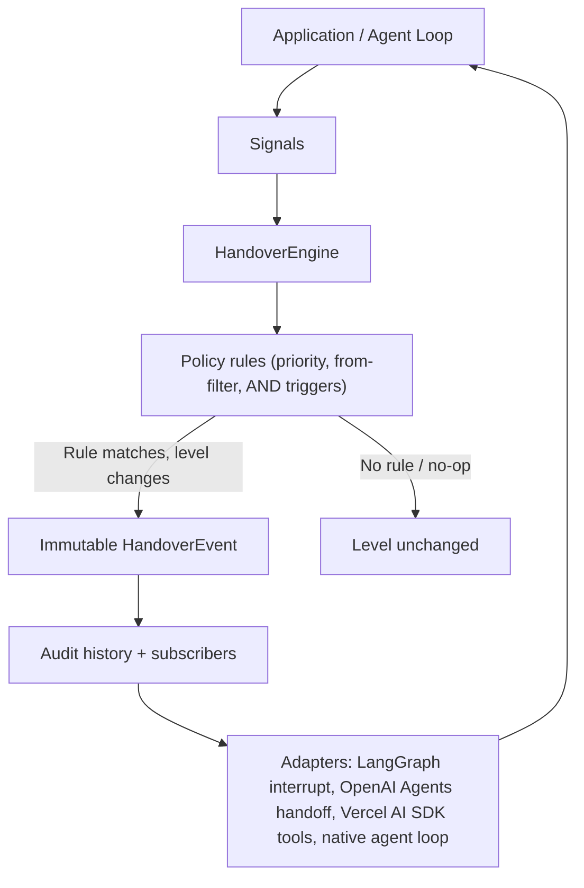

# yieldpoint

**Dynamic power handover for human-machine collaboration and multi-agent systems.**

`yieldpoint` is a zero-runtime-dependency TypeScript engine that treats **autonomy as a first-class runtime policy**. Instead of the classic "agent gets stuck -> ask a human -> approve -> continue" pattern, control between a human and a machine can move *dynamically* during task execution based on live signals such as **confidence**, **risk**, **cost**, **timeout**, and **explicit human requests**.

```bash
npm install yieldpoint
```

---

## Why yieldpoint?

Existing JS human-in-the-loop tooling (`human-in-the-loop`, `@hitl-kit`, `robotrock`) treats the human as a **static interrupt**: the agent pauses, asks a question, waits for approval, and resumes. Autonomy is binary — either the machine does everything or the human does everything.

`yieldpoint` makes the **handover itself the product**:

- A declarative `HandoverPolicy` decides *when* and *to which autonomy level* control moves, driven by live signals.
- The engine is **framework-agnostic** — it works inside any agent loop, workflow runtime, or plain Node script.
- Framework adapters (LangGraph.js, OpenAI Agents SDK, Vercel AI SDK, plain agent loops) are **optional sub-path imports** with zero runtime dependencies.
- A built-in **simulation module** scores policies across scenarios on **quality / safety / autonomy / cost**, so you can *prove* a policy's safety rate before shipping it.

### Feature highlights

- Six autonomy levels modeled on the Knight Institute human-agency scale (plus full autonomy).
- Declarative transfer rules with priority ordering, source-level filters, and AND-ed trigger sets.
- Immutable handover events with a full audit trail.
- Deterministic clock and id injection for reproducible tests and simulations.
- 100% runtime dependency-free (ESM + CJS + `.d.ts`).
- Unit-tested with 90%+ coverage and published with npm provenance.

---

## Core concepts

### Autonomy levels

The scale is inspired by the [Knight Institute](https://hai.stanford.edu/) human-agency model, extended with a `machine-only` level for complete autonomy. Autonomy increases monotonically:

| Level | Score | Who acts | Who decides | Typical use |
|-------|:-----:|----------|-------------|-------------|
| `operator` | 0 | Human | Human | Human drives the tool end-to-end |
| `collaborator` | 1 | Human + machine | Human | Joint work, machine assists |
| `consultant` | 2 | Machine proposes | Human decides | Machine drafts, human picks |
| `approver` | 3 | Machine acts | Human approves key actions | Machine executes, human approves |
| `observer` | 4 | Machine | Machine (human watches) | Machine runs, human monitors |
| `machine-only` | 5 | Machine | Machine | Full autonomy, no human in the loop |

A **handover** is any transition between levels. Moving *down* the scale (higher score -> lower score) gives the human more control; moving *up* gives the machine more control.

### Signals

The engine observes a small, extensible signal set. All fields are optional:

```ts
interface Signals {
  confidence?: number;   // machine confidence in [0, 1]
  risk?: number;         // operational risk in [0, 1]
  cost?: number;         // cost of involving a human (arbitrary units)
  humanRequest?: boolean; // one-shot: a human asked to take control
  elapsedMs?: number;    // task elapsed time (overrides the engine clock)
  [key: string]: unknown; // anything else
}
```

`humanRequest` is a **one-shot** signal: the engine consumes it after one update so it never re-fires.

### Triggers

A `TransferTrigger` is a discriminated union. Every trigger is evaluated against the current `TriggerContext` (task id, current level, signals, elapsed time, history):

```ts
type TransferTrigger =
  | { type: 'confidence'; below?: number; above?: number } // thresholds
  | { type: 'risk'; above?: number; below?: number }
  | { type: 'cost'; above?: number; below?: number }
  | { type: 'timeout'; afterMs: number }                    // elapsed >= afterMs
  | { type: 'human-request' }
  | { type: 'signal'; name: string; below?: number; above?: number } // generic
  | { type: 'custom'; test: (ctx: TriggerContext) => boolean };      // escape hatch
```

### Policy

A `HandoverPolicy` is fully declarative:

```ts
interface HandoverPolicy {
  name?: string;
  initialLevel: AutonomyLevel;        // where new tasks start
  rules: TransferRule[];              // evaluated by priority, then order
}

interface TransferRule {
  id?: string;
  from?: AutonomyLevel[] | 'any';     // which source levels the rule applies to
  when: TransferTrigger[];            // ALL must fire
  to: AutonomyLevel;                  // target level
  priority?: number;                  // higher wins (default 0)
}
```

### Events and context

Every handover produces an **immutable** `HandoverEvent`:

```ts
interface HandoverEvent {
  readonly id: string;
  readonly taskId: string;
  readonly timestamp: number;
  readonly from: AutonomyLevel;
  readonly to: AutonomyLevel;
  readonly reason: HandoverReason;    // { kind: 'trigger' | 'manual' | 'policy', description, trigger?, ruleId? }
  readonly signalSnapshot: Signals;
  readonly policyName?: string;
}
```

`AutonomyContext` is the live runtime state: current level, latest signals, and the full history.

---

## Architecture



The core engine (`createHandoverEngine`) is a pure function of `(policy, signals, time)`. It never touches timers, I/O, or any framework. Adapters live in sub-path exports so the core package stays dependency-free.

---

## Quick start

```ts
import { createHandoverEngine, type HandoverPolicy } from 'yieldpoint';

const policy: HandoverPolicy = {
  name: 'billing',
  initialLevel: 'machine-only',
  rules: [
    // Low confidence -> require a human approver
    { id: 'doubt', when: [{ type: 'confidence', below: 0.6 }], to: 'approver' },
    // Danger -> hand control to the operator immediately (highest priority)
    { id: 'danger', when: [{ type: 'risk', above: 0.8 }], to: 'operator', priority: 10 },
    // A human explicitly asked in
    { id: 'override', when: [{ type: 'human-request' }], to: 'collaborator' }
  ]
};

const engine = createHandoverEngine(policy);
engine.createTask('order-42');

const result = engine.update('order-42', { confidence: 0.4, risk: 0.1 });
console.log(result.changed);        // true
console.log(result.currentLevel);   // 'approver'
console.log(result.event?.reason);  // { kind: 'trigger', ruleId: 'doubt', ... }
```

### Engine API

| Method | Description |
|--------|-------------|
| `createTask(taskId, initialLevel?)` | Track a new task (throws if it exists). |
| `hasTask(taskId)` / `getContext(taskId)` | Inspect a task's runtime state. |
| `update(taskId, signals?)` | Feed signals in; let the policy decide. Returns an `UpdateResult`. |
| `tick(taskId)` | Re-evaluate timeout rules without new signals. |
| `transfer(taskId, to, reason?)` | Explicitly move control. Returns the event or `null` if unchanged. |
| `requestHuman(taskId)` | Shortcut for `update(taskId, { humanRequest: true })`. |
| `reset(taskId, level?)` | Clear history (recording a `policy` event) and restore a level. |
| `removeTask(taskId)` | Stop tracking a task. |
| `history(taskId)` | Immutable handover audit trail. |
| `subscribe(listener)` | Listen to every handover event. Returns an unsubscribe fn. |

Engine options: `now` (clock), `createId`, `maxHistory`, `validateSignals`, `autoCreate`.

---

## Policies in practice: a medical assistant

```ts
import { createHandoverEngine, type HandoverPolicy } from 'yieldpoint';

const medicalPolicy: HandoverPolicy = {
  name: 'medical-assistant',
  initialLevel: 'machine-only',          // low-risk tasks start fully autonomous
  rules: [
    // Emergency: risk signal hands control to a clinician
    { id: 'emergency', priority: 30, when: [{ type: 'risk', above: 0.7 }], to: 'operator' },
    // Prescriptions always require a human approver
    {
      id: 'prescription-gate',
      priority: 20,
      when: [{ type: 'custom', test: (c) => c.signals.category === 'prescription' }],
      to: 'approver'
    },
    // Low confidence anywhere -> ask for approval
    { id: 'low-confidence', priority: 10, when: [{ type: 'confidence', below: 0.6 }], to: 'approver' },
    // Patients can always request a human
    { id: 'human-request', when: [{ type: 'human-request' }], to: 'collaborator' }
  ]
};

const engine = createHandoverEngine(medicalPolicy);
engine.createTask('prescription-1');

// Routine scheduling -> fully autonomous
const routine = engine.update('prescription-1', { confidence: 0.98, risk: 0.05, category: 'scheduling' });
console.log(routine.currentLevel); // 'machine-only'

// High-risk prescription -> the policy forces approval
const rx = engine.update('prescription-1', { confidence: 0.9, risk: 0.3, category: 'prescription' });
console.log(rx.currentLevel); // 'approver' — a human approves before the machine acts

// Doctor approves
engine.transfer('prescription-1', 'machine-only', 'Doctor approved the prescription');
```

Run the full runnable demo with:

```bash
npm run demo
```

---

## Framework adapters (optional, zero runtime deps)

Adapters are **sub-path exports** and are never loaded by the core package. Each adapter is duck-typed against its target SDK, so you bring your own dependency — no bundled copies, no peer-dependency conflicts.

### LangGraph.js — interrupt nodes

```ts
import { createLangGraphAdapter } from 'yieldpoint/adapters/langgraph';
import { interrupt, Command } from '@langchain/langgraph'; // your dependency

const engine = createHandoverEngine(policy);
const adapter = createLangGraphAdapter({ engine, taskIdResolver: (state) => state.taskId });

function myNode(state: any) {
  const decision = adapter.decide(state, { confidence: 0.4 });
  if (decision.shouldInterrupt) {
    const resume = interrupt(decision.payload); // pause the graph for a human
    return new Command({ resume });
  }
  return { notes: 'autonomous step' };
}

// After the human responds:
// const { resume } = adapter.resume(taskId, { to: 'machine-only', response: { ok: true } });
```

### OpenAI Agents SDK — dynamic handoffs

```ts
import { createOpenAIAgentsAdapter } from 'yieldpoint/adapters/openai-agents';
import { Agent, Runner, handoff } from 'openai-agents'; // your dependency

const adapter = createOpenAIAgentsAdapter({ engine, taskId: 'billing' });

const assistant = new Agent({
  name: 'assistant',
  tools: [adapter.handoffTool()] // run() returns { handoff: {...} } when a human is required
});

// Or decide imperatively before each turn:
const decision = adapter.shouldHandoff({ risk: 0.9 });
if (decision.shouldHandoff) {
  // return await handoff(decision.payload);
}
```

### Vercel AI SDK — tool gating

```ts
import { tool } from 'ai';
import { z } from 'zod';
import { createVercelAISDKAdapter } from 'yieldpoint/adapters/vercel-ai-sdk';

const adapter = createVercelAISDKAdapter({ engine, taskId: 'triage' });

const queryRecords = adapter.gateTool(tool({
  description: 'Query patient records',
  inputSchema: z.object({ id: z.string() }),
  execute: async ({ id }) => db.patients.find(id)
}));
// Throws ApprovalRequiredError at 'approver' and ToolBlockedError at denied levels
// unless you provide an onBlocked callback.
```

### Native agent loop

```ts
import { createHandoverEngine } from 'yieldpoint';
import { runAgentLoop } from 'yieldpoint/adapters/agent-loop';

const engine = createHandoverEngine(policy);

const result = await runAgentLoop({
  engine,
  taskId: 'invoice',
  runStep: async ({ level }) => ({ output: await generateInvoice(), signals: { confidence: 0.95 } }),
  humanTurn: async ({ level }) => { const ok = await askHuman(); return { ok, confidence: 0.99 }; }
});

console.log(result.finalLevel, result.events.length);
```

---

## Evaluating a policy: `simulate`

Prove a policy before you ship it. Describe scenarios with per-step signals, a **max safe level**, and machine quality; `runSimulation` produces a four-dimensional report plus the full audit trail.

```ts
import { runSimulation, formatReport, type Scenario, type HandoverPolicy } from 'yieldpoint';

const scenarios: Scenario[] = [
  {
    name: 'emergency',
    steps: [
      { signals: { risk: 0.95 }, maxSafeLevel: 'operator', quality: 0.8 },
      { signals: { risk: 0.2, confidence: 0.9 }, maxSafeLevel: 'machine-only', quality: 0.95 }
    ]
  },
  {
    name: 'routine',
    steps: [{ signals: { confidence: 0.99, risk: 0.05 }, maxSafeLevel: 'machine-only', quality: 0.99 }]
  }
];

const report = runSimulation(policy, scenarios);
console.log(formatReport(report));
```

### Metric definitions

| Metric | Formula |
|--------|---------|
| **quality** | Mean credited quality across steps. A step executed by a human credits `1`; a step executed by the machine credits the step's `quality` (default `1`). |
| **safety** | Fraction of steps whose autonomy level is at or below the step's `maxSafeLevel`. This is your **safety rate**. |
| **autonomy** | Mean autonomy score (0..5) normalized to [0, 1]. |
| **cost** | Sum of human-execution costs (default `1` per human step) plus a transfer cost (default `0.5`) for every handover that moves control toward the human. |

The `safetyRate` in the report is the aggregate **safe steps / total steps** across all scenarios — the number to quote when someone asks "how safe is this policy?".

---

## Why not just use an existing HITL library?

| | `human-in-the-loop` | `@hitl-kit` | `robotrock` | **yieldpoint** |
|---|---|---|---|---|
| Control model | Static pause/approve | Static pause/approve | Static decision steps | **Dynamic handover policy** |
| Autonomy as a runtime policy | No | No | Partial (workflow steps) | **Yes — first-class** |
| Level model | None | None | Custom steps | **6-level scale (Knight-model + machine-only)** |
| Live signals (confidence/risk/cost/timeout) | No | No | Limited | **Built-in trigger set + custom** |
| Multi-level source filtering & priorities | No | No | No | **Yes** |
| Framework adapters | Small | React-based | Workflow-bound | **LangGraph / OpenAI Agents / Vercel AI SDK / plain loop** |
| Policy evaluation / simulation | No | No | No | **quality/safety/autonomy/cost report** |
| Runtime dependencies | Some | React peer deps | Some | **Zero** |

If your control flow is "pause at this fixed point and ask", those libraries are fine. If you want autonomy to *adapt* to risk, confidence, cost, and time during a single run — and to be able to *measure* that adaptation — use `yieldpoint`.

---

## Development

```bash
npm install
npm run lint        # eslint
npm run typecheck   # tsc --noEmit
npm test            # vitest
npm run test:coverage  # vitest with 90%+ threshold
npm run build       # tsup: ESM + CJS + .d.ts
npm run demo        # run the medical assistant demo
```

The full verification report (test results, coverage, build artifacts, demo output, and consumer install checks) lives in [`TESTING.md`](./TESTING.md).

### Publishing

A `v*` tag push triggers the `Publish` workflow (`.github/workflows/publish.yml`), which runs the full quality gate and then `npm publish --provenance --access public`. Configure an `NPM_TOKEN` secret on the repository for automation. To publish manually from a machine authenticated with npm:

```bash
npm version patch    # bump version + tag
npm publish
```

The package publishes `dist/` (ESM, CJS, and type declarations), `README.md`, and `LICENSE` only.

---

## License

[MIT](./LICENSE)

---

## Roadmap

- [ ] State-machine transitions (restrict valid `from -> to` pairs per level)
- [ ] Composite triggers with explicit AND/OR semantics
- [ ] Budget-aware handover (cost ceilings across a whole session)
- [ ] More framework adapters (CrewAI, Pydantic AI JS, LangChain runnables)
- [ ] Deterministic policy testing utilities and golden-file scenario suites

Contributions welcome — open an issue or a pull request.
